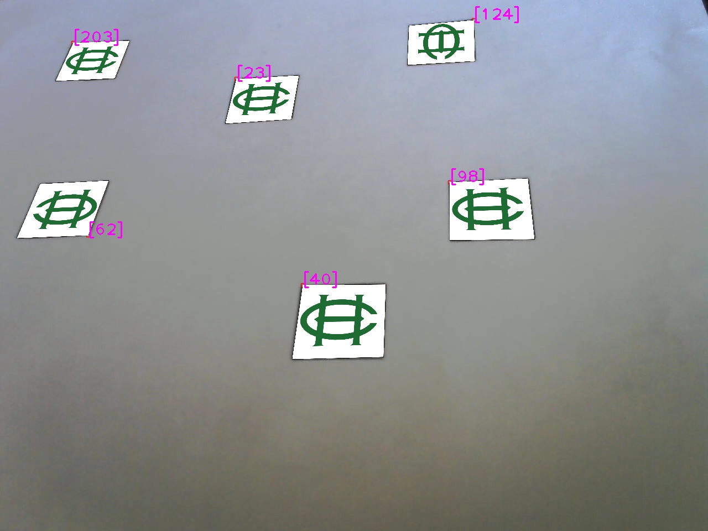

# Image Augumentation

Simplpe repository to do image augumentation using aruco markers and opencv library.

## Outputs

In the following images and videos the ouptut of the aruco augumentation is shown.

